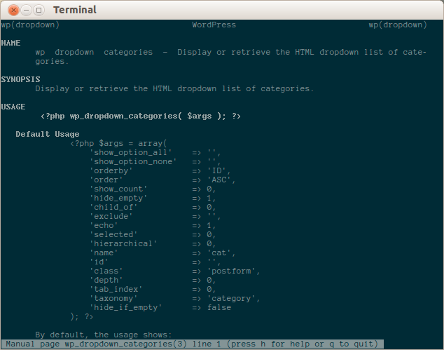

This is the entire "Function Reference" section of the [WordPress
Codex](http://codex.wordpress.org), as retrieved sometime around mid-May 2013,
converted to man page format.

I'm just trying this out for usefulness, if I or anyone else finds that it's
helpful, I'll probably add some more utility functions for automatically updating,
and an install script/package.

For now, you can just clone the repo or download it, and manually alias a
function to look up these man pages.

For example, if you clone this repo to ~/bin/wpman, try adding this line to your `~/.bash_aliases`:

	function wpman () { man -M ~/bin/wpman $1; }

Then the command `wpman` will be available from your prompt, like so:

	$ wpman wp_dropdown_categories

If you use pman, you could also just copy all of these files into the directory
pman keeps its documentation. On my machine that was
`/usr/share/php/doc/pman/`. This is obviously a stupid approach, but if you're
like me and just want to be able to look up all your function definitions in
one place, it works.

How it was made:

- I used a scraper hosted on scraperwiki to pull down a list of pages on
  the Codex - [source here](https://scraperwiki.com/scrapers/wp_codex/),
- retrieved all pages with "Function Reference" in the title using wget, 
- used pandoc to convert them all to markdown,
- did some minor quick-and-dirty processing of the markdown files with sed and
  vim to get it closer to the format of a man page, and
- finally converted the markdown files into roff format using 
  [md2man](https://github.com/sunaku/md2man) (for some reason pandoc's output
  was always corrupted.)
